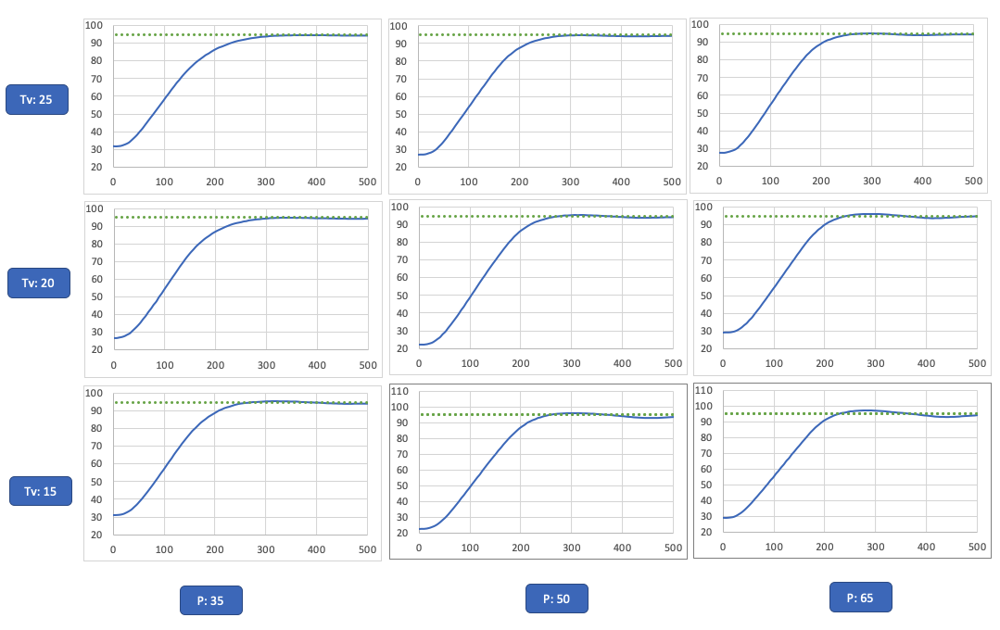
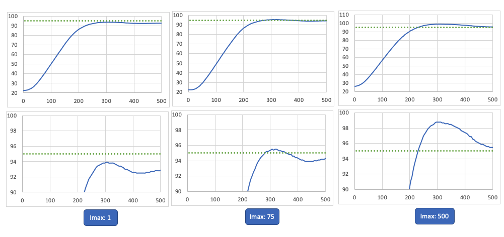

# PID-Werte
{: .no_toc }

Inhaltsverzeichnis

* TOC
{:toc}

## Einleitung

Ab Release 3.0.1 wurde der PID-Regler nochmals deutlich vereinfacht und verbessert. Die frühere Brüherkennung (wer sie noch kennen sollte) ist faktisch nur noch in seltenen Fälle notwendig.
Die PID soll folgende Betriebszustände korrekt regeln.

 

Bereiche | Erklärung
:--|:--
1 | Kaltstart
2 | Regulärer Betrieb (Temperatur halten)
3 | Brüherkennung (BD)

Die zugehörigen Werte lassen sich im Webinterface auf der Seite "Parameters" einstellen:

 

Parameter | Erklärung
:--|:--
Enable PID Controller | muss beim ersten Start aktiviert werden, schaltet den PID-Regler an/aus
Enable PonM | Alternativer PID-Modus, war für den alten Kaltstart relevant, Standardmäßig "aus"
PID Kp | Proportional-Anteil des PID
PID Tn (=Kp/Ki)| Integral-Anteil vom PID
PID Tv (=Kd/Kp) | Differenzial-Anteil vom PID
PID Integrator Max | Begrenzt den Integrator des I-Anteil, wichtig für das Halten der Temperatur.
Steam Kp | P-Anteil für den Dampfmodus
Set point (°C) | Soll-Temperatur
Offset (°C) | Wird zur gemessenen Temperatur addiert, nur für die Anzeige relevant, Standard: 0
Enable Brew PID | Aktivieren um andere PID-Werte während des Brühens zu setzen, optional, im Normalfall nicht empfohlen
PID BD Time (s)| Bei "PID Only" ohne Optokoppler maximale Bezugszeit im Display
PID BD Sensitivity | Empfindlichkeit der PID Brew Detection im Bezug auf Abfall der Temperatur (0 = aus, kleinere Werte: hohe Empfindlichkeit, höhere Werte: geringere Empfindlichkeit der Erkennung)

## Standardwerte für diverse Maschinentypen

### Rancilio Siliva
Parameter | Rancilio Siliva V1-2 | Rancilio Siliva V3-V6 | Rancilio Silvia seitlicher Sensor
:--|:--|:--|:--
PID Kp | 62 | 50 | 55
PID Tn (=Kp/Ki)| 52 | 200 | 65
PID Tv (=Kd/Kp) | 11.5 | 20 | 13
PID Integrator Max | 75 | 75 | 75 
Steam Kp | 150 | 150 | 150
PID BD Sensitivity | 120 | 60 | 120

## Hinweise zur Optimierung
Ohne eine vollständig Abhandlung über einen PID Regler zu liefern, kann kurz und knapp der Einfluss des Reglers wie folgt beschrieben werden:

Der P Anteil – auch Kp genannt – verstellt die Heizleistung proportional zur Reglerabweichung. Bei 20 °C Abweichung und P = 20 ergibt sich 400, bei P = 10 ergeben sich 200. Ein Regler mit nur einem P Anteil neigt zum Schwingen.

Der I Anteil – genauer gesagt Tn – ist dafür da, eine stetige Reglerabweichung zu korrigieren, indem sich dieser über eine Integralbildung die vergangene Abweichung „merkt“. Es ist quasi das Gedächtnis des Reglers. Je kleiner Tn (vereinfacht in der App als I bezeichnet), desto stärker greift der I Anteil im Regler ein. Der Parameter PID Integrator Max begrenzt hierbei den Speicher. 

Der D Anteil ist dafür da auf plötzliche Reglerabweichungen zu reagieren. Hierbei wird die zeitliche Veränderung / Steigung analysiert. Der D Anteil ist für das „schnelle Eingreifen“ hilfreich.

Bei einer Optimierung sollte zunächst der normale Betriebszustand (Temperatur halten) angepasst werden,
hierbei sind vor allem PID Integrator Max und auch PID Kp relevant für die Einstellungen. Der durchschnittliche Heizwert der die Temperatur aufrecht erhält, sollte etwa PID Integrator Max sein. Dieser darf aber auch nicht zu groß gewählt werden, wie sich gleich zeigen wird.
Beim Kaltstart muss vor allem PID Kp, PID Tv angepasst werden, so dass ein Überschwingen vermieden wird, die Solltemperatur aber innerhalb einiger Minuten erreicht wird.
Während und nach dem Bezug spielen vor allem PID Kp und PID Tv eine Rolle, da dort schnell wieder geheizt werden soll, ein Überschwingen aber mittels ausreichend großem Tv abgedämpft wird.

Folgende Messreihe zeigt euch, wie eine Veränderung von P und I (TV) das Startverhalten verändert:
 

Im Detail sieht es wie folgt am Setpoint aus:

 

Eine Erhöhnung von P führt zu deutlichen überschwingen, wobei hier eine Erhöhung von I gegensteuert. Wobei insgesamt alle 9 Wertepaare gute Ergebnisse liefern. Einen deutliche Veränderung hat hierbei der Wert PID Integrator Max. Dieser ermöglicht, dass sich der "Puffer" durch die stätige Regelabweichung beim Start stärker aufladen kann und über eine längere Zeit abbauen muss, auch wenn der Setpoint längst erreicht ist.

 

### Brühvorgang
Bei der Ausbaustufe "PID Only" (ohne Plus) ist die "PID BD Time (s)" und "PID BD Sensitivity" nur noch notwendig, um die Zeitanzeige im Display korrekt anzuzeigen. Diese Werte haben keinen Einfluss mehr auf den PID, solange "Enable Brew PID" deaktiviert ist. Mit Aktivierung von "Enable Brew PID", können nochmals eigene PID-Werte für den Brühvorgang gesetzt werden. Diese sind für die Dauer von "PID BD Time (s)" aktiv.
Es ist in der Regel aber nicht ratsam, während des Brühens stärker nachzuheizen, da die Maschine selbst möglichst Temperaturstabilität durch aufgeheiztes Metall ermöglicht (Rancilio Silvia). Durch starkes nachheizen steigt dann u.U. die Temperatur im Sieb sogar an was nicht ideal ist. Bei kleineren/günstgeren Maschinen kann dies aber nicht so gut funktionieren und ein sofortiges Nachheizen sinnvoll sein.

 

Parameter | Erklärung
:--|:--
BD Kp | P-Anteil vom PID bei Bezug
BD Tn (=Kp/Ki) | I-Anteil bei Bezug
BD Tv (=Kd/Kp) | D-Anteil bei Bezug
