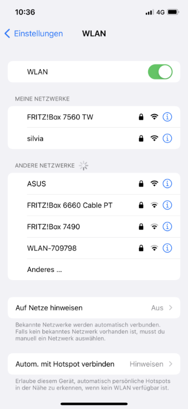
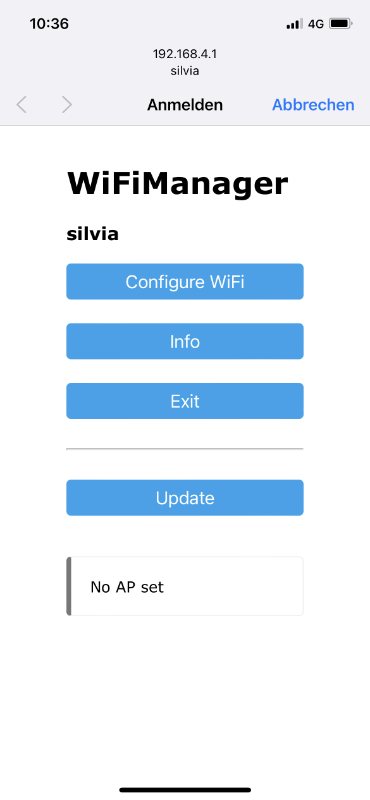

# Ersteinrichtung WLAN
{: .no_toc }

Inhaltsverzeichnis

* TOC
{:toc}


## Kurzzusammenfassung
Für die Ersteinrichtung wird der Wifi-Manager benutzt. Beim ersten Start vom Nodemcu wird ein Access Point von diesem geöffnet mit dem in der userconfig eingestellten ```HOSTNAME``` (default: "silvia") und Passwort ```PASS``` (default: "CleverCoffee"). Verbindet euch mit dem Access Point, wählt euer WLAN aus und gibt euer Passwort vom Router ein, dann wird dies automatisch gespeichert beim nächsten Start des Nodemcu.
## Schritt für Schritt
Wenn ihr den Code hochlädt, wird die Konsole folgende Meldungen ausgeben:
```
*wm:[1] AutoConnect 
*wm:[1] No Credentials are Saved, skipping connect 
*wm:[2] Starting Config Portal 
*wm:[2] AccessPoint set password is VALID 
*wm:[2] Disabling STA 
*wm:[2] Enabling AP 
*wm:[1] StartAP with SSID:  Silvia
*wm:[1] AP IP address: 192.168.4.1
*wm:[1] Starting Web Portal 
*wm:[2] HTTP server started 
*wm:[2] Config Portal Running, blocking, waiting for clients... 
```
Die IP-Adresse müsst ihr euch merken, um später die Webseite für die Ersteinrichtung aufzurufen.
Wenn ihr noch per Handy/PC nach einem Wlan sucht werdet ihr das Netzwerk "Silvia" sehen



Wenn ihr euch mit dem Netzwerk verbunden habt, geht eine Portalseite auf oder ihr gibt per Browser die IP 192.168.4.1 ein.



Mit dem Klick auf "Configure Wifi" könnt ihr eurer Wlan auf dem Nodemcu einrichten.


Wählt das Netzwerk oben aus der Liste ein oder gibt eure SSID manuell ein, zusätzlich eurer Passwort vom Wlan.
Nach dem "Save" sollte der Nodemcu neustarten und ist für eurer Wlan eingerichtet.
