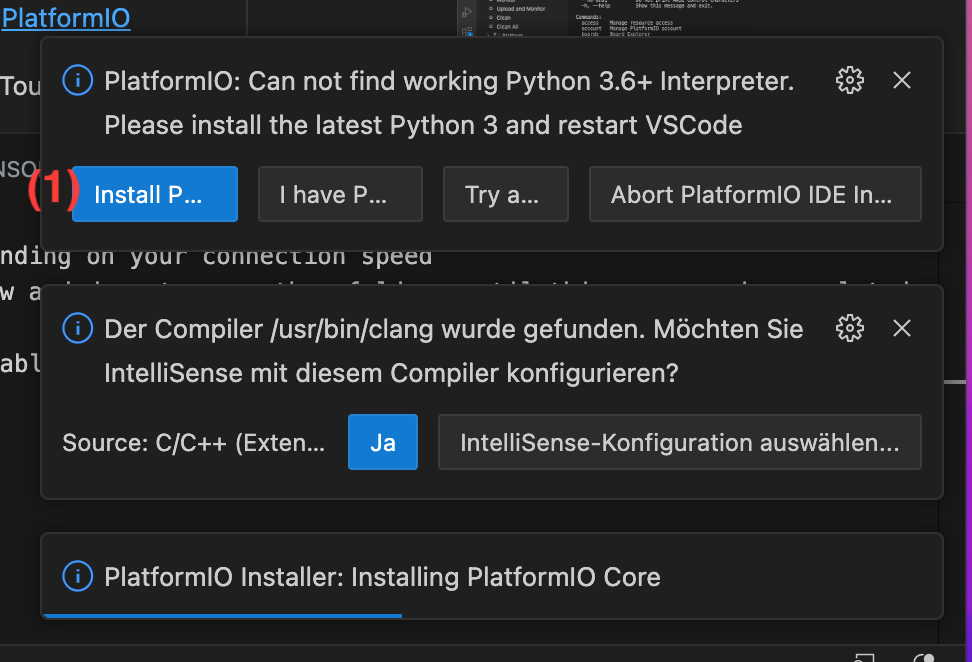
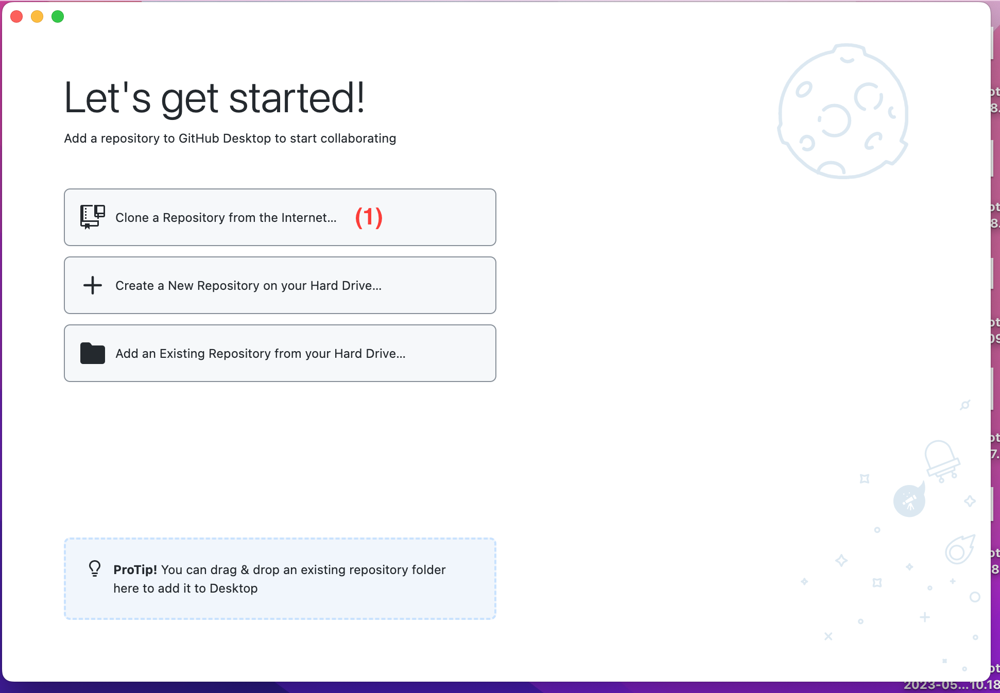
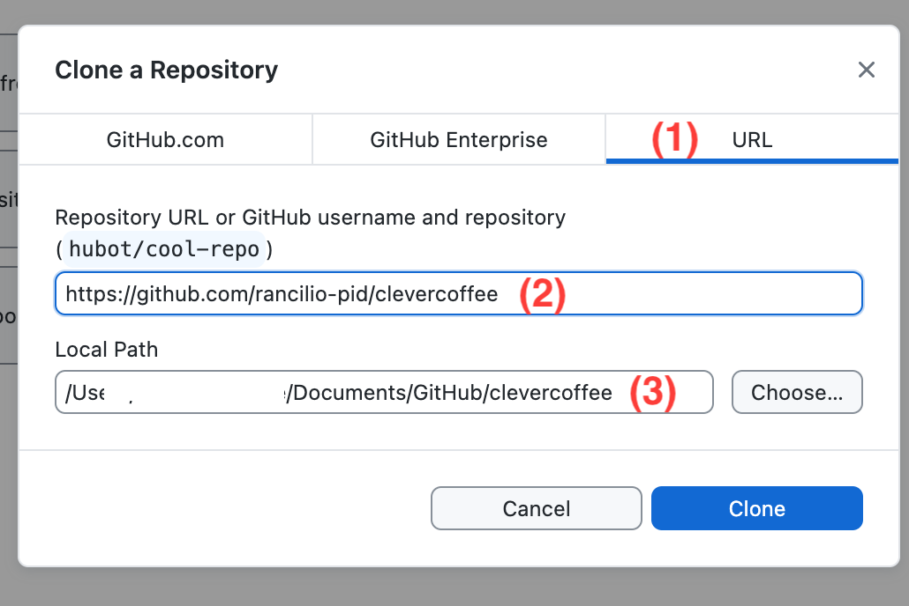
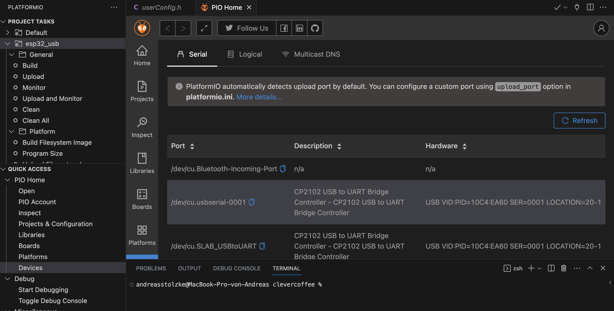
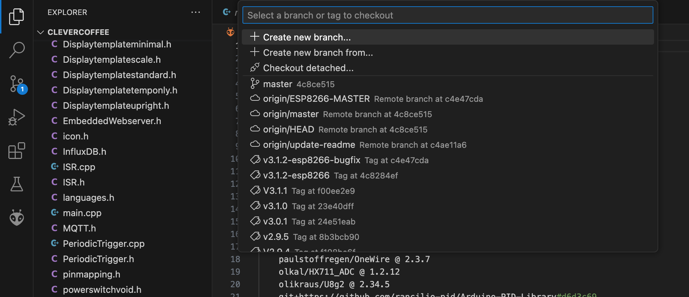
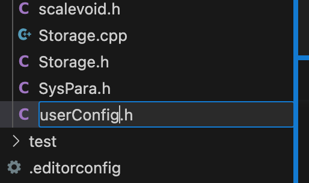

#   {{ page.title }}
## Übersicht
Ab der Version 4 für den ESP32 werden folgende Softwaretools benötigt:
* Visual Studio Code
* PlatformIO (eine Extension in VS Code)
* Github Desktop
* Treiber für den ESP32


## Installtion Visual Studio Code & PlatformIO

Geh auf die Webseite von [VS Code](https://code.visualstudio.com/download) und lade deine entsprechende Version herunter.
Öffne VS Code.

Suche bei Extensions (1) nach "platformio" (2). Klicke Install (3) und PlatformIO wird installiert.

Hierbei kann unten rechts im Fenster eine Meldung zeigen, dass weitere Softwarepakete fehlen:


Z.B. Muss Python extern installiert werden. Durch den Klick auf "Install Phyton" (1) gelangt ihr in die Dokumentation
von PlatformIO. Befolgt dort die weiteren Installtionsschritte. Klickt dann in VS Code in der Meldung "Try again" 
Am Ende zeigt euch folgende Meldung, dass PlatformIO erfolgreich installiert wurde:


Ihr könnt aber zum aktuellen Stand ohne git oder Github Desktop nicht unseren Code komplieren. Falls ihr dies doch tut erhaltet ihr z.B. eine folgende Fehlermeldung:


Ihr könnt an dieser Stelle VS Code erst eimal schließen

## Installtion Github Desktop

Ladet euch Github Desktop herunter [Github Desktop](https://desktop.github.com),installiert es und startet es.
Klickt (1) "Clone a Repository from the internet"

Es erscheint eine neue Eingabemaske:

In der Eingabemaske "URL" klicken (1), bei (2) die URL von unserem Repository eingeben:
https://github.com/rancilio-pid/clevercoffee
Und euren Speicherort (3) auswählen. Clone klicken und ihr seid mit Github fertig. 

## Treiber ESP32 
Ihr benötigt ggf. einen Treiber für den ESP32. Ihr könnt prüfen in PlatformIO unter "Device", ob euer ESP32 erkannt wird:


Klickt in VSCode unter auf das PlatformIO Symbol ("Ameisenkopf") (1) und wählt "Devices" (2). Hier müsste bei angestecken ESP32 dieser zu sehen sein:


Es müsste ein Gerät mit "CP2102" am usbserial-X auftauchen. Wenn dies nicht der Fall ist testet bitte nochmals einen zweites USB-Kabel (manche Kabel sind nur zum Laden geeignet).
Wenn hier immer noch kein dein ESP32 auftaucht, müsst ihr den Treiber installieren:

[Treiber ESP32](https://www.silabs.com/developers/usb-to-uart-bridge-vcp-drivers)

Der Treiber sollte auch für den ESP8266 gehen, solange der gleiche Controller verbaut ist (CP2102).

WICHTIG! Nach der Installation muss der Rechner neugestartet werden!

## Auswahl der SW-Version für den ESP32
Nach dem Neustart vom Rechner, könnt ihr prüfen, ob ihr die Sofware compilieren könnt.
Öffnet das Verzeichnis in VSCode, welches ihr in Github kopiert habt. File -> Open Folder 
In dem oberen Fall wäre dies /Documents/Github/clevercoffee

In VS Code drückt ihr im Fall von MAC Shift + CMD + P oder nutzt die Taskleiste von VS Code: View -> Command Palette
Hier geht ihr ein (1): "git: checkout to" 
 

Drück Return oder klickt per Maus den Befehl an und es erscheint eine Auswahlliste aller Versionen:
 

Für den ESP32 sind nur die Versionen ab 4.X.X relevant, in dieser Version wird nicht mehr der ESP8266 unterstützt. 
Die "origin/master" ist die aktuelle Version der Entwicklung für den ESP32. 

Die Master "origin/ESP9266-master" ist die alte Entwicklungsversion für den ESP8266. Hier gibt es nur noch Bugfixes. Die aktuelle Version vom ESP8266 ist jeweils die Version mit dem Zusatz "-esp8266" z.B: "v3.1.2-esp8266"
Wählt die aktuellste Version für den ESP32 aus. Es dauert paar Sekunden und dann sollte der Code heruntergeladen sein.

##  Compilieren vorbereiten
Bevor ihr die Version kompilieren könnt müssen noch kleinere Vorbreitungen passieren. 
Geht in VS Code in den Verzeichnisbaum vom Code, öffnet den Ordner /src und benennt die "userconfig_sample.h" in "userconfig.h" um:
 

Ihr könnt nun in dieser Datei einige Dinge zu eurer Espresso Maschine einstellen. Diese sind auch ausführlicher später im Handbuch erläutert. Wichtig sind hier vor allem "ONLYPID" und die Konfiguration für den späteren Hostnamen oder die OTA Einstellungen. Die WLAN Einrichtung von euerem Netzwerk findet später direkt auf dem ESP8266 per Access Point statt.
##  Compilieren
Nun kann der Code compiliert werden. Hierzu sind folgende Schritte notwendig:
Drückt wieder das Symbol von PlatformIO (rechts in der Leiste). Ihr könnt später per OTA auch Daten auf den ESP32 übertragen, aber aktuell muss dieser per usb bespielt werden. Der ESP32 muss hierbei angeschlossen sein per USB Kabel.
Bei jeden Upload Schritt oder Erase auf den ESP32 kann es passieren, dass dies nicht sofort durchläuft.
WICHTIG: Haltet die Taste "Boot" auf dem ESP gedrückt (ohne PINS kurzzuschließen), dann kann ein Upload per USB durchgeführt werden (Bei OTA besteht später das Problem nicht).
 

Bei jedem Teilschritt das "SUCESS" in der Konsole abwarten:
1. (1) Daher wählt "esp32_usb" aus.  
1. (2) "Erase flash" (Boottaste am ESP32 drücken) klicken, warten bis "SUCESS"
1. (3) "Build Filesystem Image" klicken, warten bis "SUCESS"
1. (4) "Upload FIlesystem Image", Boottaste am ESP32 drücken bis aufsteigende Prozent zu sehen sind, warten bis "SUCESS"
1. (5) Unter dem Punkt " Genereal" "Build" klicken, warten bis "SUCESS"
1. (6) Upload klicken, Boottaste am ESP32 drücken bis aufsteigende Prozent zu sehen sind, warten bis "SUCESS"
1. (7) Monitor zum ESP32 öffnen, dann sollte folgendes zu sehen sein:

```
[00:00:02] Connect to WiFi: "silvia" 
*wm:[1] AutoConnect 
*wm:[2] Setting Hostnames:  silvia
*wm:[2] Setting WiFi hostname 
*wm:[2] ESP32 event handler enabled 
*wm:[2] Connecting as wifi client... 
*wm:[2] setSTAConfig static ip not set, skipping 
*wm:[1] Connect Wifi, ATTEMPT # 1 of 3
*wm:[1] No wifi saved, skipping 
*wm:[2] Connection result: WL_NO_SSID_AVAIL
*wm:[1] Connect Wifi, ATTEMPT # 2 of 3
```
Glückwunsch der ESP32 (oder ESP8266) ist nun mit der Software bespielt, weiter geht es mit der Einrichtung vom WLAN!

